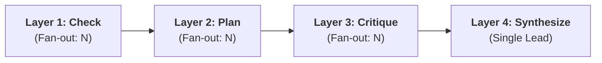
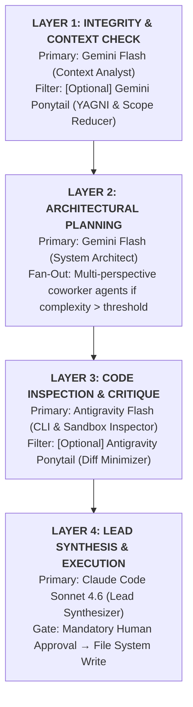
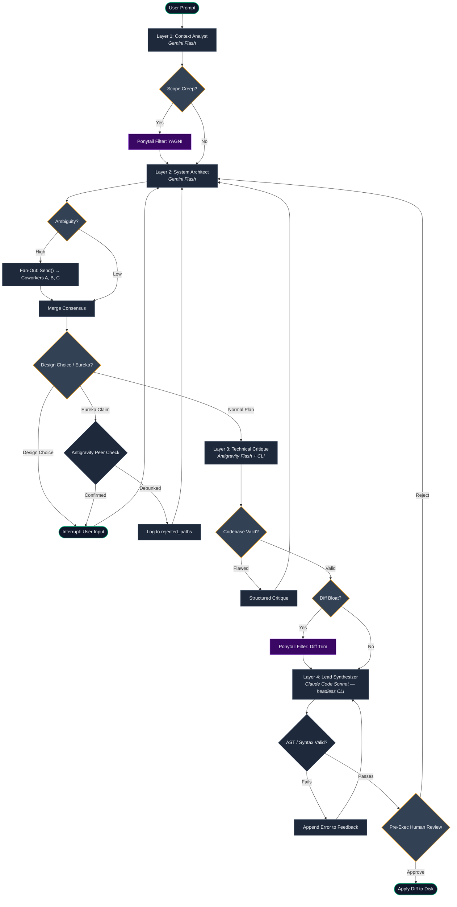

# SoyLangGraph
Multi agent conversing layered model to help with programming based tasks.


## 1. Executive Summary & Architecture Philosophy

**SoyLangGraph** is a multi agent orchestration framework built on top of LangGraph. Rather than relying on a single mega-prompt or a rigid sequential pipeline, it models software engineering workflows as a **dynamic, layered state machine with emergent agentic fan-out**.



### Core Tenets
1. **Asymmetric Compute Allocation:** Use high-speed, cost-effective models (**Gemini Flash / Antigravity Flash**) for 90% of ideation, repo crawling, and debate loops. Reserve frontier models (**Claude Code / Sonnet 4.6**) exclusively for final code synthesis.
2. **Context Isolation (The "Unpolluted Mind"):** Planners and reviewers operate without raw script bloat to maintain architectural clarity; synthesis agents receive only verified, compact specifications.
3. **Dynamic Agentic Fan-Out (NN-Style Coworkers):** When an agent encounters high uncertainty or architectural ambiguity, it branches into specialized sub-agents seeded with targeted biases (e.g., Performance, Simplicity, Security) before consolidating consensus.
4. **Context Poisoning Mitigation:** Shared workspaces use append-only structured scratchpads with explicit sanity filters to prevent consensus decay.

---

## 2. Layered Pipeline Specification

The workflow progresses through four discrete layers, each featuring conditional **Ponytail Pragmatism Gates**.



### Layer 1: Context & Integrity Check
* **Role:** Analyzes the incoming task against user requirements. 
* **Ponytail Gate (Conditional):** If the request includes speculative features or unnecessary abstractions, execution routes through the **Gemini Ponytail Filter** to strip scope creep before planning begins.

### Layer 2: Architectural Planning
* **Role:** Formulates file-by-file implementation blueprints and interface designs.
* **Escalation Trigger:** If architectural tradeoffs exist, Layer 2 triggers dynamic fan-out to evaluate competing designs via LangGraph's `Send` API.

### Layer 3: Technical Critique & Code Inspection
* **Role:** Leverages **Antigravity Flash** — Gemini Flash bound to local CLI and filesystem execution tools — to inspect directory trees, read existing code, run linters, verify imports, and benchmark plan feasibility. This is distinct from the "Clean Mind" Gemini Planner in Layer 2, which has no direct repo access.
* **Ponytail Gate (Conditional):** Enforces diff minimization to ensure proposed changes do not rewrite functional legacy systems.

### Layer 4: Lead Synthesis & Assembly
* **Role:** **Claude Code (Sonnet 4.6)** receives the distilled, approved technical specification and generates the target code. It is invoked as a **headless CLI subprocess** (`claude -p`) with a system prompt that enforces unified diff output — diff formatting is a prompt contract, not a CLI flag (`--output-format` supports `text/json/stream-json`, not `diff`). Receives only the isolated `current_plan` and `target_files` — never raw agent debate history. Output is written to stdout only; no files are touched before human approval.
  ```bash
  claude -p "Output ONLY a valid git unified diff. No prose.\n\n<plan>"
  ```
* **Human Gate:** Halts execution for mandatory user approval before disk writes. The diff is displayed in the terminal and applied only on explicit confirm.

---

## 3. Dynamic Fan-Out: The Coworker Spawning Mechanism

When an agent in Layer 2 or Layer 3 encounters an ambiguous or computationally difficult problem, it does not guess. Instead, it spawns N localized coworker sub-agents via **LangGraph's `Send` API (Map-Reduce pattern)**, allowing true parallel dispatch.

```mermaid
flowchart TD
    Parent["<b>Layer Agent: Stuck / High Ambiguity</b>"]
    
    CW_A["<b>Coworker A: Minimalist</b><br/>• Bias: YAGNI / Minimal code<br/>• Input: Parent State + Bias"]
    CW_B["<b>Coworker B: Cynic</b><br/>• Bias: Edge-cases & failure modes<br/>• Input: Parent State + Bias"]
    CW_C["<b>Coworker C: Optimizer</b><br/>• Bias: Performance / Resource cost<br/>• Input: Parent State + Bias"]
    
    Consensus["<b>Layer Synthesis & Consensus</b>"]

    Parent -->|Send()| CW_A
    Parent -->|Send()| CW_B
    Parent -->|Send()| CW_C
    CW_A --> Consensus
    CW_B --> Consensus
    CW_C --> Consensus
```

Dynamic dispatch example:
```python
from langgraph.constants import Send
from typing import Literal

class CoworkerInput(TypedDict):
    bias: Literal["minimalist", "cynic", "optimizer"]
    plan_to_review: str
    system_constraints: List[str]

def route_planning_layer(state: SoyGraphState):
    # fanout_depth: 0 = simple task (no fan-out), 1+ = ambiguity detected by Layer 2
    # capped by LayerConfig.max_branch_depth
    if state["fanout_depth"] > 0:
        payload = CoworkerInput(
            plan_to_review=state["current_plan"] or "",
            system_constraints=state["layer_blackboard"].system_constraints,
        )
        return [
            Send("coworker_agent", {**payload, "bias": "minimalist"}),
            Send("coworker_agent", {**payload, "bias": "cynic"}),
            Send("coworker_agent", {**payload, "bias": "optimizer"}),
        ]
    return "synthesize_plan_node"
```

### Perspective Injection (Agent Biases)
Each spawned coworker receives the **Parent State + a Distinct Behavioral Bias Matrix**:
* **The Minimalist (YAGNI Bias):** *"How do we solve this using only built-in platform features with zero new dependencies?"*
* **The Cynic (Edge-Case Bias):** *"How will this break under race conditions, invalid inputs, or network timeouts?"*
* **The Optimizer (Performance Bias):** *"What is the memory and compute overhead of this abstraction?"*

### Safe Branching Limits (`GraphConfig`)
To prevent infinite token consumption, fan-out is strictly governed by configuration flags:

```python
class LayerConfig(TypedDict):
    max_fanout_width: int       # Maximum concurrent sub-agents per layer (e.g., 3)
    max_branch_depth: int       # Max recursive split depth (e.g., 2 levels)
    max_critique_cycles: int    # Max review loops before forcing user intervention (e.g., 3)
    temperature_variance: float # Distinct seed variance for coworker divergence
```

Circuit breaker — the `critique_iteration_count` field is not decorative; routing nodes must check it:
```python
def route_after_critique(state: SoyGraphState):
    if state["critique_iteration_count"] >= config["max_critique_cycles"]:
        return "interrupt_human_escalation"
    return "layer2_replan"
```

---

## 4. Shared Blackboard & Context Poisoning Mitigation

As sub-agents analyze the problem, they contribute findings to a **Shared Layer Blackboard**.

```
[ Layer Blackboard ]
  ├- Section 1: Verified File Paths & Interfaces (Facts)
  ├- Section 2: Rejected Hypotheses (Prevents circular logic)
  └- Section 3: Open Debates & Agent Critiques (Active discussion)
```

### Preventing Context Poisoning & Cascade Hallucination
* **Fact vs. Opinion Segregation:** Raw agent chatter stays inside the layer's local scratchpad. Only cryptographically or structurally verified assertions (e.g., verified file paths, confirmed compiler outputs) are written to the canonical blackboard.
* **The Skeptic Check:** Before any sub-agent proposal is merged into the plan, an independent verification node validates that the proposal does not contradict base repository constraints.

### Reducer Reset on Re-Plan Cycles
`coworker_findings` uses `operator.add`, which accumulates across every L2 invocation — including loopbacks from L3 critique or human rejection. Stale findings from prior iterations will pollute future coworker context.

`operator.add(existing, [])` is a no-op, so you cannot reset the field by emitting an empty list. ConsensusNode must distill all raw findings into `current_plan` and `layer_blackboard` before any loopback, and the graph must treat `coworker_findings` as consumed-per-cycle. Implementation options: a custom replace-on-epoch reducer, or a `findings_epoch: int` counter that coworker nodes check to discard stale entries.

---

## 5. Human-in-the-Loop & The "Revelation Protocol"

SoyLangGraph pauses execution for human guidance under three explicit conditions:

1. **Design Choice Gaps:** Gemini flags that two valid architectural paths exist (e.g., SQLite vs. JSON store) and requests a preference.
2. **The Revelation Protocol ("Eureka" Check):** An agent discovers a fundamental repository flaw or a 10x simpler path that changes original requirements.
3. **Pre-Execution Approval Gate:** Mandatory terminal checkpoint displaying unified diffs before Claude Code writes changes to disk.

### Revelation Protocol: Peer Verification Spec

When an agent flags a radical architectural alternative or fundamental blocker (`revelation_detected = True`), it does not unilaterally alter scope. Instead it routes through a mandatory peer check:

```
[ Agent: Revelation Detected ]
              │
              ▼
[ Peer Verification Node (Antigravity Flash) ]
  Prompt: "Agent proposed: [Alternative].
           Check against existing repo constraints.
           Does this genuinely invalidate the original premise? (YES/NO)"
              │
       ┌──────┴──────┐
    YES│             │NO
       ▼             ▼
[ interrupt() → User ]  [ Append to rejected_paths & Resume ]
```

* **YES:** State sets `interrupt_reason = "revelation_detected"` and triggers `interrupt()` for human direction.
* **NO:** The claim is logged to `layer_blackboard.rejected_paths` to prevent circular re-evaluation, and standard planning continues.

---

## 6. Complete System Flowchart



---

## 7. Canonical State Schema

Single unified definition. `original_prompt` is the immutable baseline anchor — never modified by agents. `coworker_findings` uses an `operator.add` reducer so parallel `Send()` returns append rather than overwrite.

```python
import operator
from typing import Annotated, List, Optional, TypedDict
from pydantic import BaseModel, Field

class CoworkerFinding(BaseModel):
    agent_id: str
    perspective_bias: str
    assessment: str
    suggested_modifications: List[str]

class SharedBlackboard(BaseModel):
    verified_files: List[str] = Field(default_factory=list)
    system_constraints: List[str] = Field(default_factory=list)
    rejected_paths: List[str] = Field(default_factory=list)
    active_revelations: List[str] = Field(default_factory=list)

class SoyGraphState(TypedDict):
    # Immutable Anchor (read-only baseline — never modified by agents)
    original_prompt: str
    target_files: List[str]

    # Layer Artifacts
    current_plan: Optional[str]
    layer_blackboard: SharedBlackboard

    # Parallel Fan-Out (reducer appends findings from concurrent Send() calls)
    coworker_findings: Annotated[List[CoworkerFinding], operator.add]

    # Code & Review Artifacts (Phase 1: unified diff only — synthesized_code dropped as redundant)
    proposed_diff: Optional[str]
    critique_feedback: Optional[str]

    # Deterministic & Red-Team Quality Flags
    syntax_valid: bool
    unresolved_imports: List[str]
    redteam_fatal_flaws: List[str]
    diff_line_count: int

    # Loop Controls
    critique_iteration_count: int  # L3→L2 critique cycles; capped by max_critique_cycles
    syntax_retry_count: int        # L4→GateAST retries; capped at 2, then interrupt_human_escalation
    fanout_depth: int
    interrupt_reason: Optional[str]
```

---

## 8. Anti-Hallucination & Output Quality Verification

Multi-agent debate loops are vulnerable to **groupthink** — agents validating each other's flawed assumptions. SoyLangGraph implements three lightweight, deterministic guardrails to ensure generated code and plans remain production-grade.

```
┌──────────────────────────────┐
│  1. Deterministic CLI Gate   │ ──(Fails Syntax/Imports)──> [ Immediate Node Loopback ]
│  (AST Parser / Type Checker) │
└──────────────┬───────────────┘
               │ Passes
               ▼
┌──────────────────────────────┐
│ 2. Adversarial Red-Team Node │ ──(Finds Critical Flaw)───> [ Re-plan with Critique ]
│   (Forced Failure Hunter)    │
└──────────────┬───────────────┘
               │ Passes
               ▼
┌──────────────────────────────┐
│   3. Immutable Goal Anchor   │ ──(Scope Drift Detected)──> [ Ponytail Scope Trim ]
│ (Original Prompt Validation) │
└──────────────┬───────────────┘
               │
               ▼
        [ Proceed to Human Gate ]
```

### 1. Deterministic CLI Sanity Gates (Post-Layer 4, Pre-Human Gate)
After Claude Code emits its diff, lightweight non-LLM subprocesses run before the human approval prompt. Layer 3 can run dependency checks on the *plan*, but AST/type correctness can only be verified on *generated code* — so this gate lives after Layer 4:
* **AST/Syntax Verification:** Checks Python syntax with `ast.parse()` or JS/TS via `tsc --noEmit` on the proposed diff to catch syntax errors and non-existent imports before the human sees it.
* **Dependency Reality Check:** Validates newly introduced packages against existing lockfiles (`package.json`, `pyproject.toml`) to prevent hallucinated third-party libraries.

### 2. The Adversarial "Devil's Advocate" Worker
During Layer 2 coworker fan-out, one sub-agent (Coworker B: Cynic) is strictly initialized with an **Adversarial Falsifier Prompt**:
* **Objective:** Find at least 2 concrete edge cases, race conditions, or performance bottlenecks.
* **Rule:** The red-team agent is forbidden from offering praise; it only outputs specific breaking points or passes the plan if no breaking points exist.

### 3. The Immutable State Anchor
To prevent task drift over multiple review cycles:
* `original_prompt` and baseline `target_files` are stored in **read-only state fields**.
* Every critique cycle checks the diff against this anchor to ensure agents have not quietly dropped original user requirements.

### 4. Diff Budgeting (Scope Enforcement)
* If an agent proposes rewriting an entire file when a localized fix is requested, the diff budget trigger flags the output as over-engineered.
* Automatically forces a retry with the **Ponytail Minimizer** before escalating to Claude Code.

---

## 9. Setup & Runtime Requirements (WIP)

SoyLangGraph spans a dual-runtime environment:

* **Python Runtime (>= 3.11):** Core graph orchestration, state persistence, and verification tools.
  ```
  pip install langgraph google-genai pydantic
  ```
* **Node.js Environment (>= 18):** Global installation of `@anthropic-ai/claude-code` CLI, invoked as a headless subprocess (`claude -p`) for Layer 4 synthesis.
  ```
  npm install -g @anthropic-ai/claude-code
  ```

> Active development — Phase 1 spike: `state.py` (canonical state schema), `graph.py` (mock spine nodes, routing, circuit breakers), `test_graph.py` (routing and integration tests, no LLM calls). Gate3 branching, `peer_verification`, and `human_approval` reject path are Phase 2.
