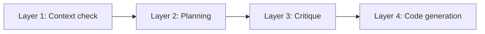
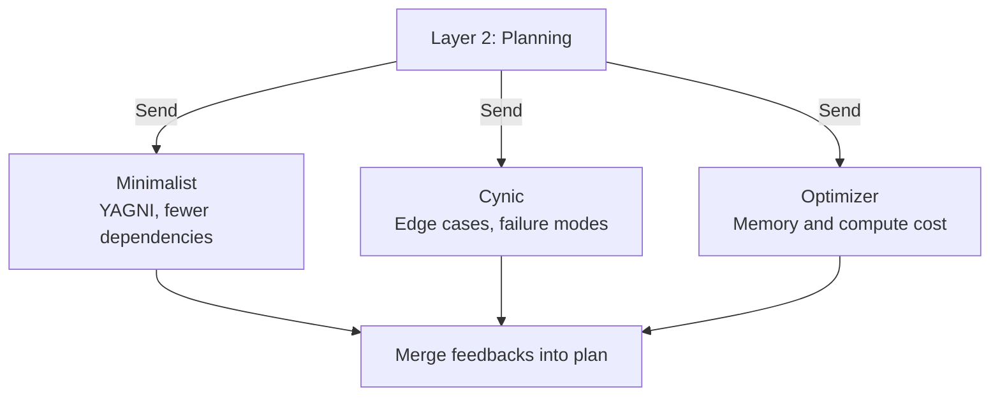

# SoyLangGraph
Multiagent layered pipeline for programming tasks.
This is my first project with LangGraph and more of a learning piece.

This project will likely not receive updates! I've learned and tried enough from it and this project will instead evolve into 'MAPDev' with an actual frontend and backend.

In this I wanted to learn how multiagent routing works. Different agents handle different tasks better, so I wanted to see how effective it would be to run multiple layers of Gemini agents to process user input and branch out into Claude as the sole programmer.

The idea is similar to how agents use sublevel agents, except the agent itself can fork (not yet implemented) and scale as needed.

## How it works

Four layers, each handled by Gemini Flash.

The task flows through each layer until the end at 'human approval gate' where you review the generated diff before programmer starts.



### Layer 1: Context check
Reads the task and the current workspace, then produces an initial plan and figures out which files need to change. In interactive mode it pauses here so you can review and change the plan before next layer.

### Layer 2: Planning
Expands the plan into more details. If the task looks complex enough it fans out to three reviewer agents in parallel before merging their feedback into the plan.

### Layer 3: Critique (NYI)
Checks the spec for technical feasibility.

### Layer 4: Code generation
Generates the scripts, computes a diff against the current version on disk, and runs syntax check. If the diff passes it pauses for user approval before it's actually saved.

---

## Coworker fanout

When Layer 2 determines the task is non trivial it starts three agents in parallel using LangGraph's Send API. Each agent reviews the plan from a different angle (Bias) and their feedbacks get merged before Layer 3 runs.



---

## Human gates

Two 'checkpoints' where the graph pauses for you.

1. **Plan review** (interactive mode only) after Layer 1, before fanout runs. You can approve the plan, reject it, or type a correction and L1 will retry with your feedback.
2. **Diff approval** after Layer 4, before anything writes to disk. Shows the full diff and waits for a y before applying.

If retries keep failing the graph escalates and asks for your direction instead of looping forever.

---

## Setup

```bash
pip install langgraph google-genai pydantic python-dotenv
```

Create a `.env` file in the project root:
```
GEMINI_API_KEY=your_key_here
```

Run a task:
```bash
python run_live.py "add feature x y z into this project"
python run_live.py --auto # skips the plan review gate
```

---

## Current state

Phases 1 through 3 are complete. The full pipeline runs end to end for all workspace scan, L1 planning, coworker fanout, L4 code generation, syntax check, human approval, and final write.

## Postmortem

I didn't expect this project to go on too long considering it was mainly a learning project but it was quite cool to see it work in general. It defniitely seemed alot easier in the planning phase to think "multiple layer of agents will be good", but in practice this adds latency and overall cost if not managed properly. I still think there's potential to this idea which is why I'll be working on new project that branches off from current states from here where these problems will actually be handled in a (hopefully) more efficient and less 'naive' way.